# 🪷 SenChain — Blockchain Marketplace for AI-Generated Game Assets (Mockup)

INTE2581 S2 2026 · Assessment Task 3. This web mockup shows how a Vietnamese marketplace for AI-generated game assets can use blockchain, smart contracts, NFTs and AI provenance. It demonstrates a solution for the five assignment issues.

> **The mockup simulates everything.** No real chain, wallet, payment, or AI exists. State lives in `localStorage`.

## Intro clip (≈15 s)

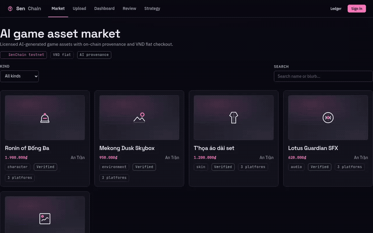

> Same clip as MP4 (click to download): [docs/img/demo.mp4](docs/img/demo.mp4)

## Screenshots

| | |
|---|---|
| **Market** — stat-led head, filter + search, SVG asset glyphs, AI-verified chips | 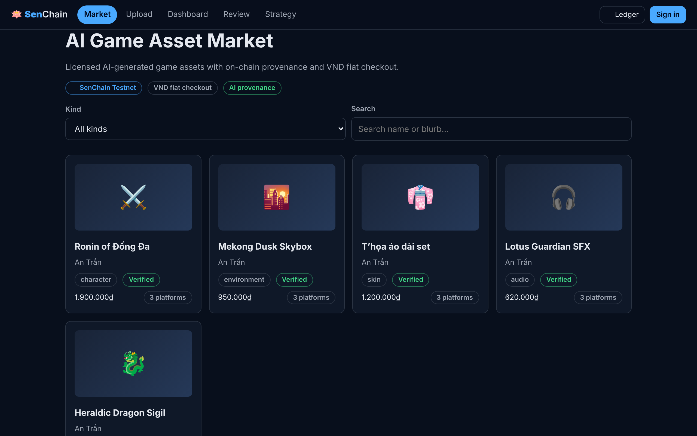 |
| 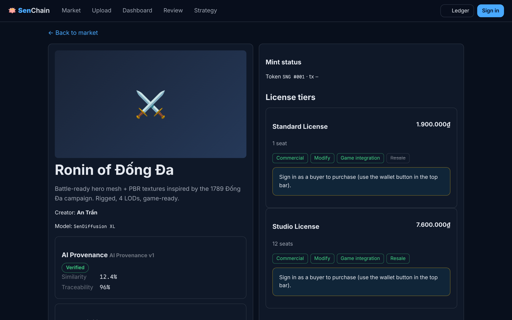 | **Asset detail** — provenance kv, compatibility passport, tiers with rights matrix, numbered checkout rail |
| **Checkout** — fiat method, step rail (pay → verify → issue), decline-payment test toggle | 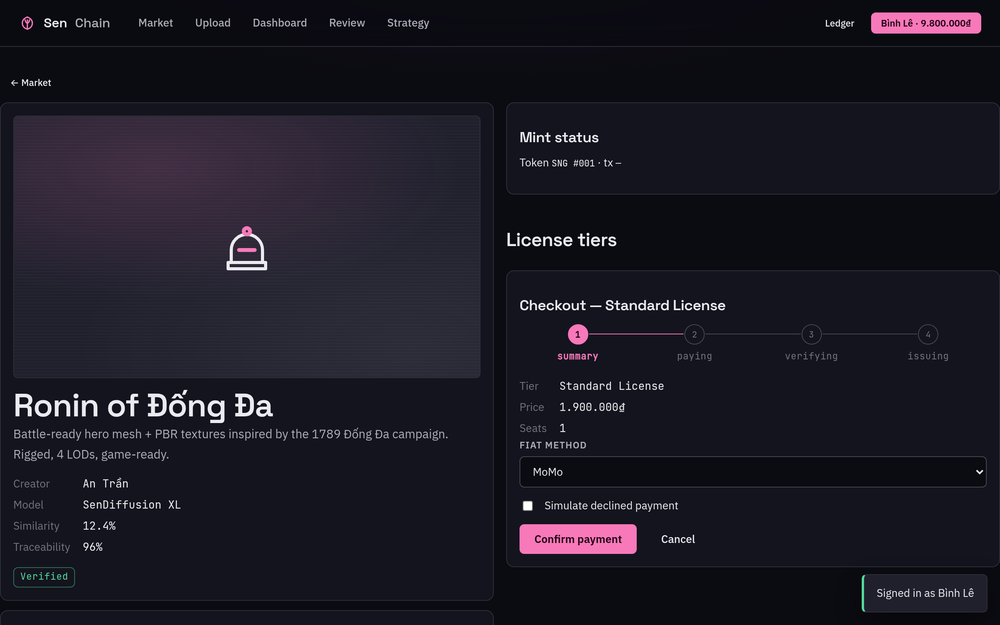 |
| 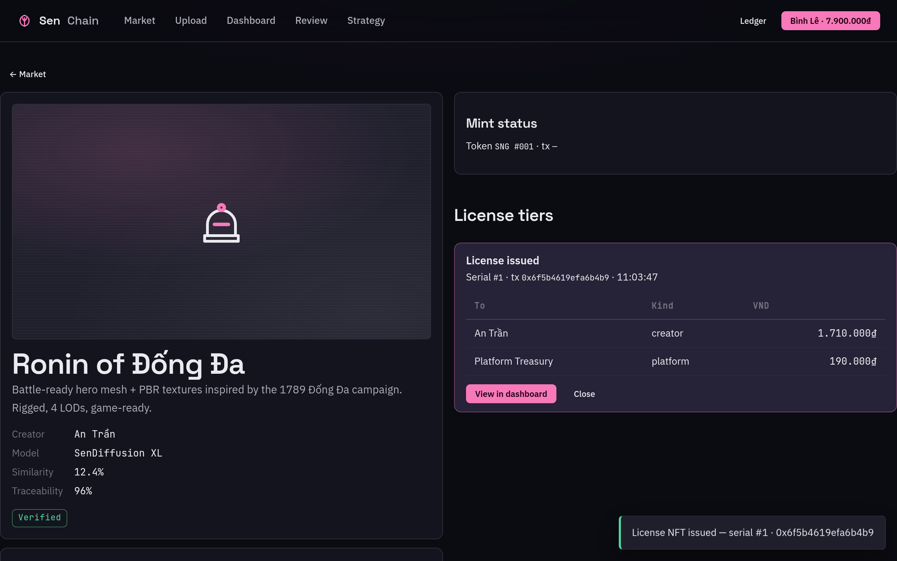 | **License NFT issued** — serial `#1`, tx hash, 90/10 split table, toast |
| **Ledger** — every on/off-chain event, contract calls, revert rows in lotus red | 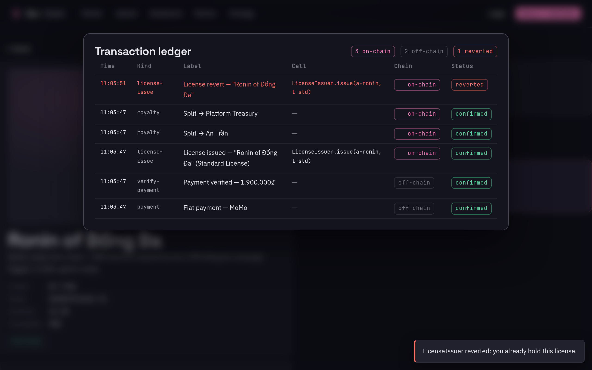 |
| 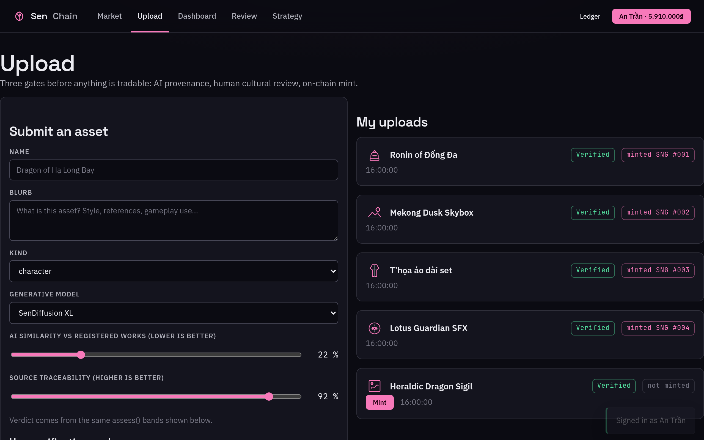 | **Upload** — similarity/traceability sliders with live readout, verdict bands from CONFIG, mint queue |
| **Review** — human cultural-review queue for flagged assets | 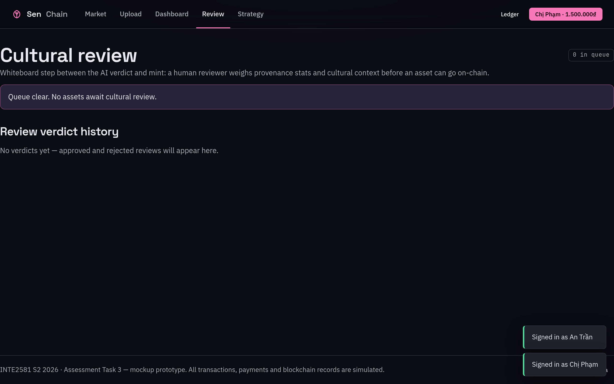 |
| 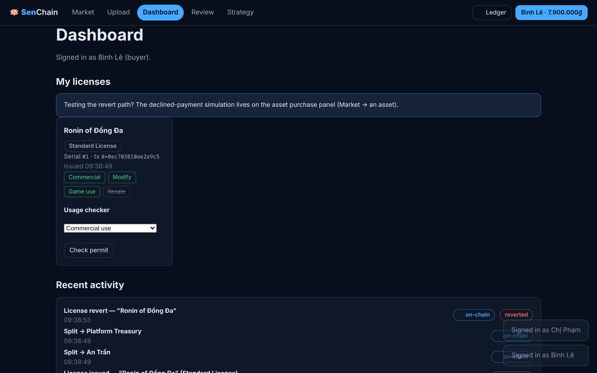 | **Dashboard** — owned License NFTs, rights matrix, usage checker (permit/revert), activity ledger |
| **Strategy** — architecture, limitations, Y0→Yx roadmap (long-document rhythm) | 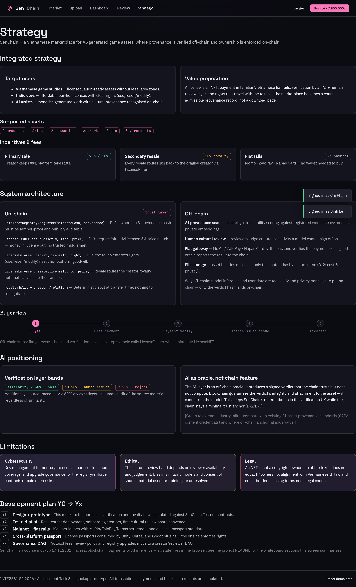 |
| 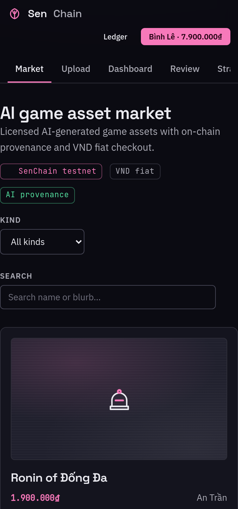 | **Responsive** — no horizontal scroll at 375 px |

## Run with mise (recommended)

```bash
mise run start                              # build + docker + open http://localhost:8080
 mise run tunnel --ddnstok YOUR_TOKEN        # serve https://ntduckk-terraforge.duckdns.org
 mise run setup                              # install bun/python deps + e2e browser (non-docker deps)
 mise run check                              # typecheck + tests + build + STE lint
 mise run e2e                                # 83-check journey suite (server must be up)
```

The tunnel needs `cloudflared` at `~/.local/bin/cloudflared` (falls back to `ngrok` on PATH). `mise run start` needs Docker on PATH.

## What the prototype demonstrates (assignment → screen)

| Assignment requirement | Where |
|---|---|
| B2 user roles | Sign in (top-right): An Trần (creator) · Bình Lê (buyer) · Chị Phạm (reviewer) |
| B2 deployed smart contracts | `GameAssetRegistry` · `LicenseIssuer` · `LicenseEnforcer` (simulated, visible in the ledger) |
| B2 one meaningful transaction | Buy a license: fiat payment → payment verify → contract issue → 90/10 split |
| B2 contract condition enforcement | Double-license revert · resale-right revert · usage permits |
| B2 on-chain vs off-chain | ⛓ chips on every ledger row · architecture screen |
| Issue 1 ownership/licensing | Rights matrix per tier (Standard/Studio/Remix) + usage checker |
| Issue 2 AI provenance | Upload → scan → verdict bands (<30 pass · 30–50 human review · ≥50 reject · <80 trace audit) → cultural review → mint |
| Issue 3 transparent payments | Purchase steps + split tables + full ledger overlay |
| Issue 4 interoperability | Compatibility passport per asset (platforms × formats) |
| Issue 5 security/governance | Strategy screen limitations + upgrade/governance notes |

## Demo script (5 min)

1. Sign in as An Trần. Open the Upload tab. Keep the sliders at 22%/92%. Submit. The verdict is machine-verified. Mint it.
2. Upload again with similarity 62%. The system rejects it. At 35% the asset needs human review.
3. Sign in as Chị Phạm. Open the Review tab. Approve the borderline asset. Sign back as An Trần and mint it.
4. Sign in as Bình Lê. Open Market → Ronin → Buy license. Watch the pay → payment verify → issue steps. The license shows serial `#1` and the split 1.710.000₫/190.000₫.
5. Buy the same tier again. The smart contract reverts the request. The ⛓ Ledger shows the revert row.
6. Open Dashboard → usage checker. Commercial use passes. Resale fails on a Standard tier. A Studio tier permits resale and pays a 10% creator royalty.
7. The footer button **Reset demo data** restores the seed state.

## Repo map

```
src/
  types.ts config.ts        # domain contract + tunables (bands, splits, chain names)
  lib/                      # verification policy · license rights · royalty splits · glyphs · ids
  store.ts                  # pure state transitions (mint, issueLicense, transfer, usage)
  app.ts persist.ts flow.ts # commit() container · localStorage · purchase orchestration
  ui.ts                     # hyperscript h() + router + formatters (no framework)
  screens/                  # market · asset · upload · dashboard · review · strategy · overlays
  style.css tokens.css      # Sen Lotus design system (OKLCH, locked tokens)
tests/store.test.ts         # 12 bun tests: bands, splits, reverts, balances
tests/e2e_smoke.py          # 35-check Playwright journey suite
docs/SRS.md USER_GUIDE.md   # requirements spec · walkthrough
.decisions/decisions.md     # D-1..D-16 traceable decision log
```

## Gates

`bun run check` · `bun test` (12) · `bun run build` · `bash tools/ste-lint.sh` (ASD-STE100) · e2e: start the dev server or the Docker container, then run `python tests/e2e_smoke.py` (35 assertions, needs Playwright Chromium).
